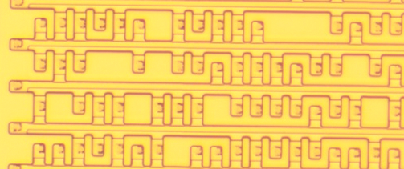
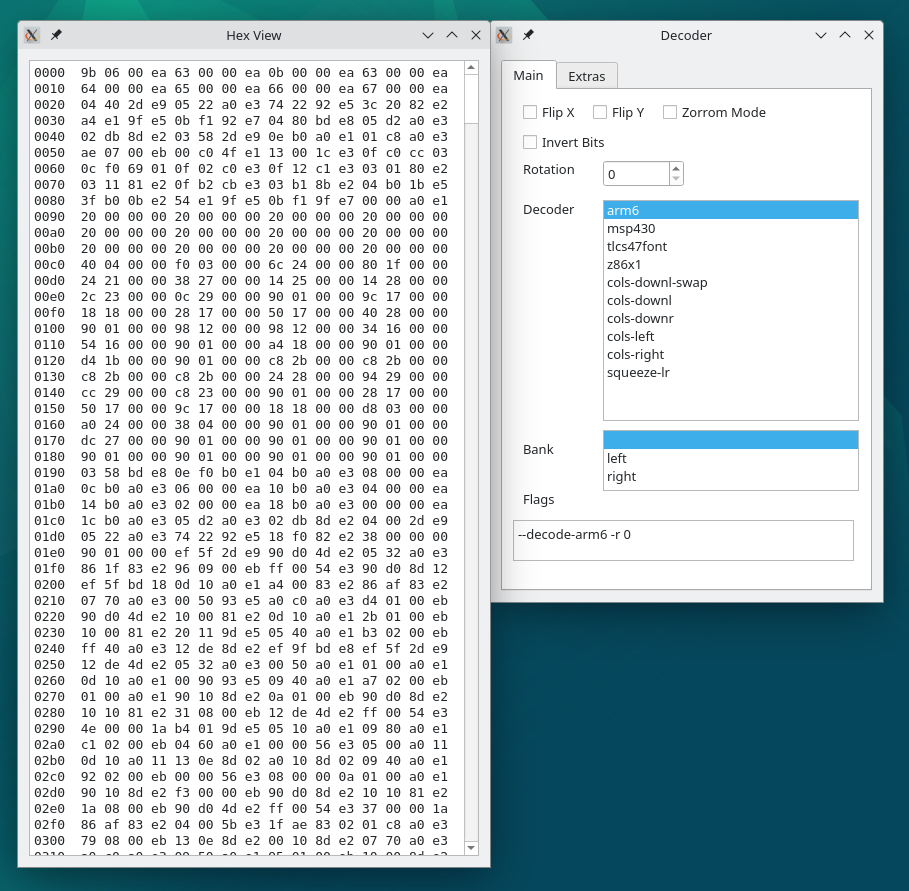
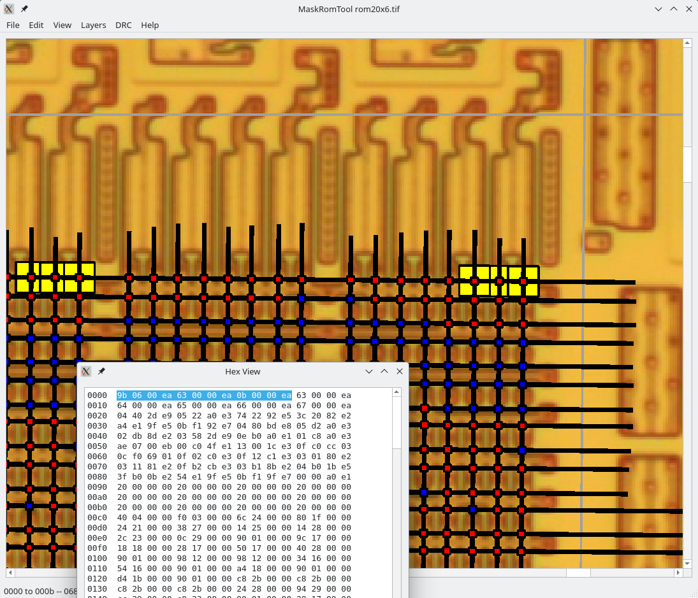
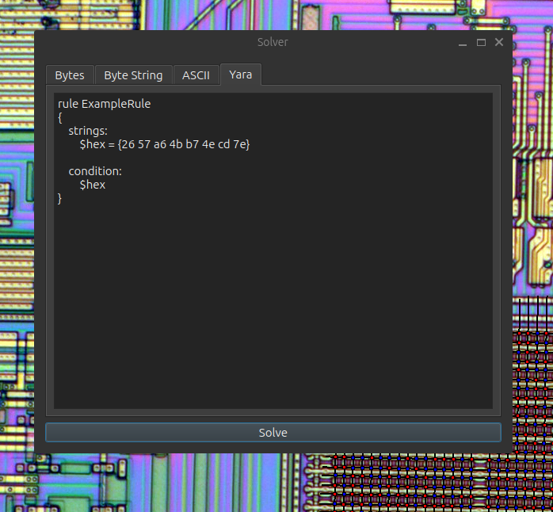

Howdy y'all,

This is my CAD tool for taking photographs of a mask ROMs and
extracting the bits, so that the contents of the ROM can be recovered.

The keyboard shortcuts in this tool are *not* optional.  Please read
the GUI documentation below before starting to explore.

--Travis Goodspeed


## Examples

[gbrom-tutorial](https://github.com/travisgoodspeed/gbrom-tutorial)
teaches you how to begin with photographs of the GameBoy's mask ROM
and work your way to an accurate ROM image.

[MYK82 ROM](https://github.com/travisgoodspeed/myk82rom) holds a
completed dump of the ROM from the MYK82 chip in a Fortezza Card.
This is the successor to the Clipper Chip, and the repository includes
not just all ROM bits but also reshoots for error correction.

[wersi-slm2-51173](https://github.com/travisgoodspeed/wersi-slm2-51173/)
is a Zilog Z8 ROM from a music synthesize module.

## Release Changelog

`master` -- Gatorom's solver-set option now uses descriptive
fiilenames.  GUI can now export a set of solved results with
File/Export/SolverSetBytes.  Clearer selection rectangle.  `R` and `C`
will now draw the correct line type when the user confuses them.
`^H` now sets the home position.  Zooming and movement keys
now work in the second view.

2024-07-14 -- Fixes crash when deleting a double-selected item.  Delete
and backspace now delete objects like `D`.  Multiple disassemblers.
Decodings are now updated as decoding thresholds are changed.

2024-06-23 -- Yara rule solving.  Stability improvements.  Crosshairs
update to the angles of selected lines.  Space now repeats the last
line, whether row or column.  Multiple items can be selected, and
SHIFT+D duplicates them.  Select with SHIFT to add more lines or CTRL
(CMD on macOS) to remove lines.  Right dragging moves multiple lines,
previewing only relevant bits.  Crosshair and selection colors are now
selectable.  Background is no longer tiled when zooming out.

2024-05-19 -- DRC violations are now cleared when bits are forced.
Histogram export for ploting the color distributions in GNUPlot.
Support for Wayland.  Explicit wordsize support in CLI, GUI, solver
and basic decoders.  Solver sets, exporting all potential solutions as
binary files.  Unreliable aligner has been deprecated.  GUI solver.
Disassembler calls out to MAME's Unidasm.

2024-01-28 -- Undo and Redo.  Strings dialog.  Backslash key for layer
visibility.  Reliable alignment algorithm.  Closing main window closes
application.

2024-01-01 -- Fixes bus error in Z8 decoder when solving odd sizes.
Verbose mode in the GatoROM CLI.  `squeeze-lr` mode now in GUI
decoder.  Edit menu item to clear all bit fixes.  `E` will select the
next DRC violation.  Perfectly vertical images no longer break the
alignment algorithm.

2023-12-07 -- Selection highlight.  Row/column counts in status bar.
ASCII solver.  Fixes multiple
[crashes](https://github.com/travisgoodspeed/maskromtool/issues/59) in
solver from awkward ROM sizes.  GatoROM decoding in the GUI.  Removal
of redundant decoders.  Hex viewer and highlighting of selected bytes.
GatoROM CLI is now very strict about exiting on illegal access.
[Zilog Z8](https://github.com/travisgoodspeed/maskromtool/issues/76)
ROM support.

2023-09-13 -- CLI option to disable OpenGL.  Printing support.
Working Windows build.

2023-08-06 -- OpenGL is now functional and default.  GatoROM included
for bit decoding.

2023-07-20 -- Secondary display support.  Tall sampling.  Fixes
crash when hitting `V` after deleting a line.

2023-06-17 -- Added macOS on X86_64 and ARM64.

2023-05-30 -- First Windows release.

## Building

This tool works in Windows, Linux, FreeBSD and MacOS, using QT6 with
the QtCharts extension.

Building the tool is easiest from the CLI.  In Debian Bullseye (11.x),
```
% sudo apt install make gcc g++ cmake git qt6-base-dev libqt6charts6-dev \
qt6-translations-l10n linguist-qt6 qt6-l10n-tools qt6-tools-\* qt6-image-formats-plugins
% git clone https://github.com/travisgoodspeed/maskromtool/
...
% cd maskromtool
% mkdir build; cd build
% cmake ..
% make -j 8 && sudo make install
```

In Windows and macOS, use the [Qt for Open
Source](https://www.qt.io/download-qt-installer-oss) installer, being
sure to include the Charts and Image Formats extensions.  Then open
`CMakeLists.txt` as a project.  `Ctrl+B` will then compile
`maskromtool`.  If you have a problem with your import, such as
choosing the wrong Qt installation, delete `CMakeLists.txt.user` and
reopen the project to try again.

For the convenience of Windows and macOS users, we have also made some
[Prebuilt
Releases](https://github.com/travisgoodspeed/maskromtool/releases).


## GUI Usage

First use File/Open ROM to open a ROM image as a photograph.  Try to
use uncompressed formats, but beware that macOS doesn't like TIFF
files.

Holding the control key (command on macOS) while rolling the mouse
wheel will zoom in and out.  You can also pinch-zoom on a track pad.
Dragging with the middle button will pan, or scroll with two fingers
as your operating system likes.

By arbitrary convention, the bits should be in long columns with shorter
rows.  If decoder lines are visible, they ought to be at the top of
the image.  Feel free to photograph it one way, then rotate it for
markup.

When you save your project, the image's filename will be extended with
`.json`.  This sorted and indented JSON file should be appropriate for
use in version control, such as Git repositories.

These keyboard buttons then provide most of your input.  For drawing
lines, first click once to choose as start position and then press the
key when the mouse is above the end position.  Deleting an item or
Setting its position will apply to the most recently placed line,
unless you drag a box to select a line.

Select an item by dragging over it with a left mouse click and
watching for it to turn green.  The most recently placed item is
automatically selected.  Some commands work on multiple selected
items; others just one.

You can delete a mistake with `D` or adjust its position a little with
`S`, the arrow keys, or a right-click drag.  During movement the bits
of unrelated lines might be hidden for performance, and the `M` key or
releasing the right mouse button will redraw them.


On macOS, `^` means Command instead of Ctrl.

```
Tab         -- Show/Hide bits.
\           -- Show/Hide rows and columns.
^\          -- Show/Hide background.
ALT \       -- Show/Hide crosshair.


R           -- Draw a row from the last left-click position.
SHIFT R     -- Repeat the last row.
C           -- Draw a column from the last left-click position.
SHIFT C     -- Repeat the last column.
SPACE       -- Repeat the last row or column.


D           -- Delete the selected objects.
SHIFT D     -- Duplicate the selected lines.
S           -- Set the selected object to the mouse position.
F           -- Jump to the selected item.
ARROWS      -- Move the selected items.

right-drag  -- Move the selected items. (SHIFT or ^)
middle-drag -- Pan the view.
^ wheel     -- Zoom.

Q           -- Zoom to zero.
A           -- Zoom in.
Z           -- Zoom out.
H           -- Jump to home position.
^H          -- Set the home position.


SHIFT F     -- Force a bit's value. (Again to flip.)
SHIFT A     -- Force a bit's ambiguity.  (Again to flip.)

M           -- Remark all of the bits.
SHIFT M     -- Update hex decoding and disassembly.
V           -- Run the Design Rule Checks.
SHIFT V     -- Clear the DRC violations.
E           -- Jump to next violation.

^Z          -- Undo
SHIFT ^Z    -- Redo

^S          -- Save changes.
```

When you first begin to mark bits, the software won't yet know the
threshold between a one and a zero.  You can configure this with
`View` / `Choose Bit Threshold`.

Even the best bits won't all be perfectly marked, so use `SHIFT+F` to
force bit values where you see that the software is wrong.  `SHIFT+A`
is similar, and marks a bit as being ambiguous or damaged.  The `DRC`
menu contains Design Rule Checks that will highlight problems in your
project, such as weak bits or broken alignment.

If placing many lines becomes tedious, select a group with your left
mouse button and duplicate the entire set with `SHIFT+D`.  You can
then drag it with the right mouse button to the new position, leaving
another copy in the original position.  If the framerate drops for
this, use the `TAB` key to temporarily hide all bits, which greatly
speeds up moving many lines in dense areas.

The crosshairs will adjust themselves to your most recently placed row
and column.  This should let them tilt a little to match the reality
of your photographs.

After you have marked the bits and spot checked that they are accurate
with DRC, run File/Export to dump them into ASCII for parsing with
other tools, such as [GatoROM](GATOREADME.md),
[Bitviewer](https://github.com/SiliconAnalysis/bitviewer) or
[ZorRom](https://github.com/SiliconAnalysis/zorrom).


## CLI Usage

In addition to the GUI, this tool has a command line interface that
can be useful in scripting.  Use the `--help` switch to see the latest
parameters, and the `--exit` switch if you'd prefer the GUI not stay
open for interactive use.

```
forum% maskromtool --help
Usage: maskromtool [options] image json
Mask ROM Tool

Options:
  -h, --help                 Displays help on commandline options.
  --help-all                 Displays help, including generic Qt options.
  -v, --version              Displays version information.
  -V, --verbose              Print verbose debugging messages.
  --stress                   Stress test bit marking.
  -e, --exit                 Exit after processing arguments.
  --disable-opengl           Disable OpenGL.
  --enable-opengl            Enable OpenGL.
  -d, --drc                  Run default Design Rule Checks.
  -D, --DRC                  Run all Design Rule Checks.
  --sampler <Default>        Bit Sampling Algorithm.
  --diff-ascii <file>        Compares against ASCII art, for finding errors.
  -a, --export-ascii <file>  Export ASCII bits.
  -o, --export <file>        Export ROM bytes.
  --export-histogram <file>  Export histogram.
  --export-csv <file>        Export CSV bits for use in Matlab or Excel.
  --export-json <file>       Export JSON bit positions.
  --export-python <file>     Export Python arrays.
  --export-photo <file>      Export a photograph.

Arguments:
  image                      ROM photograph to open.
  json                       JSON lines to open.
```

To run without a GUI, pass `-platform offscreen`.  If the program
crashes under Wayland, force Xorg usage by passing `-platform xcb`.

On Windows, it's awkward for an executable to have a GUI while
retaining a log on the CLI.  We solve this by producing two
executables; please use `maskromtool.exe` for the GUI and
`maskromtoolcli.exe` for the CLI.

A separate executable, `gatorom`, wraps the ROM bit decoder without
the graphics.  See [GatoROM](GATOREADME.md) for details.

```
forum% gatorom 
Usage: gatorom [options] bitstream
Gato ROM: A Decoder for Mask ROM Bits

Options:
  -h, --help                        Displays help on commandline options.
  --help-all                        Displays help, including generic Qt
                                    options.
  -v, --version                     Displays version information.
  -V, --verbose                     Talk too much.
  -w, --wordsize <8>                Word size.bits
  -r, --rotate <degrees>            Rotates the image in multiples of 90
                                    degrees.
  --flipx                           Flips the bits along the X axis.
  --flipy                           Flips the bits along the Y axis.
  -i, --invert                      Inverts the bits.
  -o, --output <out.bin>            Output file.
  --random                          Randomize a ROM for testing.
  --Random                          Randomize a crazy ROM.
  --rawwidth, --seanriddle <width>  Width of a raw binary input, in Sean
                                    Riddle's style.
  -I, --info                        Info about input.
  -d, --dis <arch>                  Disassemble.
  --print                           Print with a GUI dialog.
  --printpdf <file.pdf>             Print to a PDF file.
  --decode-tlcs47font               Decodes as a TMP47C434N Font.
  --decode-z86x1                    Decodes as a Zilog Z86x1.
  --decode-cols-downl-swap          Decodes as a uCOM4 ROM.
  --decode-cols-downr               Decodes first down then right like a
                                    Gameboy.
  --decode-cols-downl               Decodes first down then left.
  --decode-cols-left                Decodes left-to-right.
  --decode-cols-right               Decodes right-to-left.
  --decode-squeeze-lr               Decodes even bits from the left, odd bits
                                    from right like in the TMS32C15.
  -z, --zorrom                      Zorrom compatibility mode, with flipx
                                    before rotation.
  --leftbank                        Only the left half of the bits.
  --rightbank                       Only the right half of the bits.
  -a, --print-bits                  Prints ASCII art of the transformed bits.
  -A, --print-pretty-bits           Prints ASCII art with spaces.
  --solve                           Solves for an unknown format.
  --solve-bytes <bytes>             Bytes as a hint to the solver.
                                    0:31,1:fe,2:ff
  --solve-ascii                     Look for ASCII strings.
  --solve-string <bytes>            Byte string as a hint to the solver.
                                    31,fe,ff
  --solve-yara <rule>               Yara rule file.
  --solve-set <prefix>              Exports all potential solutions.

Arguments:
  bitstream                         ASCII art of ROM to decode.
```


## High Level Design

I've designed the GUI around a `QGraphicsScene`.  The underlying data
objects use the QT coordinate system, with floats for
better-than-pixel precision.

After loading a ROM photograph, the user places Columns and Rows onto
the photograph.  Every intersection of a Column and a Row is
considered to be a Bit, and a configurable color threshold determines
the value of that Bit.  Where the photograph is misread, you can also
Force the bit to a known value.

Once all of the Bits have been marked and the Threshold chosen, the
software will mark every light bit as Blue (0) and every dark bit as
Red (1).  These bits are then Aligned into linked lists of rows for
export as ASCII, for use in other tools.

To identify errors, a set of Design Rule Checks (DRC) will critique
the open project.  While the primary interface is the GUI, a CLI is
also available for scripting and testing.

## Correcting Bit Errors

While a few thousand bits might be marked without an error, larger
projects will inevitably need to manage their mistakes.

A good start is to use the DRC checks and careful configuration of the
bit thresholds until no obvious errors remain.  Then navigate the
project and hit the `tab` key to show and hide the annotations, making
sure that each bit is recognized properly.

When that is insufficient, such as for ROMs that are tens or hundreds
of kilobits, it helps to annotate the same ROM multiple times,
preferably from different photographs.  Bit errors will happen in
annotating each photograph, of course, but they will happen in
different places.  You can then use the `--diff-ascii` feature against
the output of `--export-ascii` to compare images, reconciling their
differences until all of your project files agree.

## Sampling Algorithms

Most ROMs can be read simply by reading the color of a single pixel at
the bit's center.  For those, the `Default` sampling algorithm will
work just fine.


For diffusion ROMs whose bits have been a little too delayered, the
center of the bit does not have a unique color, but it is surrounded
by slightly darker lines.  The `Wide` algorithm will take the darkest
color in each channel after sampling its size worth of bits in width,
and `Tall` does the same but vertically.



## Development

Patches and improvements to Mask ROM Tool are most welcome, but please
do not spam the issue tracker with feature requests.  Pull requests
should be submitted through the Github page, and they should not
entangle the project with dependencies upon third-party libraries.

The code is written in a conservative dialect of C++, with minimal use
of advanced features.  I've tried to comment the code and the class
definitions thoroughly.


## ROM Decoders

[GatoROM](GATOREADME.md) is included as a command line decoder that
solves for bit arrangements.  Please see its own README file for CLI
documentation, particularly for the solver methods that are not yet
supported in the GUI.

Separately, GatoROM is used as a library for decoding within the
MaskRomTool GUI.  Use Edit/Decoding to define the decoding style and
View/HexPreview to see a live decoding of the bits to hexadecimal.



From the decoder, you can highlight hex bytes and use View/Highlight
Hex Selection to visualize the selected bytes.  Here we see the first
three words of the [MYK82
ROM](https://github.com/travisgoodspeed/myk82rom), which pack 32 bits
into each position.  Disassembly is also available when `unidasm` from
MAME is in the path.



A scripted solver is also supported, in which simple masks or Yara
rules describe the expected firmware.  All matches are enumerated, and
by jumping between them you can quickly decipher images that do not
use interleving, row reversal, or other complications.




## Related Tools

John McMaster's [ZorRom](https://github.com/SiliconAnalysis/zorrom) is
an excellent decoder and the inspiration for the decoding library in
this tool.

Adam Laurie's [RomPar](https://github.com/AdamLaurie/rompar) might be
the very first bit marking tool to be open sourced.

Chris Gerlinsky's
[Bitract](https://github.com/SiliconAnalysis/bitract/) is another open
source tool for bit marking, and
[Bitviewer](https://github.com/SiliconAnalysis/bitviewer) is his
matching tool for decoding bits to bytes.

Peter Bosch's [PLA Decode](https://github.com/peterbjornx/pladecode)
is a bit marking tool used for extracting old Intel microcode.  See
his [Hardwear.io](https://www.youtube.com/watch?v=4oFOpDflJMA) talk
from 2020 for more details.

